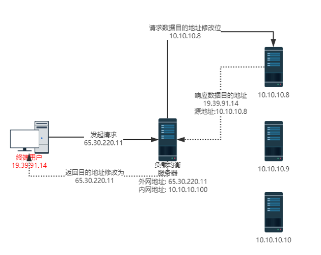

# LVS 安装使用详解

**LVS是Linux Virtual Server的简称，也就是Linux虚拟服务器, 是一个由章文嵩博士发起的自由软件项目，它的官方站点是[linuxvirtualserver](www.linuxvirtualserver.org)。**

**现在LVS已经是Linux标准内核的一部分，在Linux2.4内核以前，使用LVS时必须要重新编译内核以支持LVS功能模块，但是从Linux2.4内核以后，已经完全内置了LVS的各个功能模块，无需给内核打任何补丁，可以直接使用LVS提供的各种功能。**

## 一、LVS负载均衡服务器优点

* **工作在网络层，可以实现高性能，高可用的服务器集群技术**
* **廉价，可把许多低性能的服务器组合在一起形成一个超级服务器**
* **易用，配置非常简单，且有多种负载均衡的方法**
* **稳定可靠，即使在集群的服务器中某台服务器无法正常工作，也不影响整体效果**
* **可扩展性也非常好**


## 二、安装与配置

**linux内核2.4版本以上的基本都支持LVS，要使用lvs，只需要再安装一个lvs的管理工具：ipvsadm** 

其实LVS的本身跟iptables很相似,而且连命令的使用格式都很相似,其实LVS是根据iptables的框架开发的,那么LVS的本身分成了两个部分:

* 第一部分是工作在内核空间的一个IPVS的模块,其实LVS的功能都是IPVS模块实现的
* 第二部分是工作在用户空间的一个用来定义集群服务的一个工具ipvsadm, 这个工具的主要作用是将管理员定义的集群服务列表传送给工作在内核空间中的IPVS模块,下面来简单的介绍下ipvsadm命令的用法

**ipvsadm组件定义规则的格式 :**

```shell
#virtual-service-address:是指虚拟服务器的ip 地址
#real-service-address:是指真实服务器的ip 地址
#scheduler：调度方法

#ipvsadm 的用法和格式如下：
ipvsadm -A|E -t|u|f virutal-service-address:port [-s scheduler] [-p[timeout]] [-M netmask]
ipvsadm -D -t|u|f virtual-service-address
ipvsadm -C
ipvsadm -R
ipvsadm -S [-n]
ipvsadm -a|e -t|u|f service-address:port -r real-server-address:port [-g|i|m] [-w weight]
ipvsadm -d -t|u|f service-address -r server-address
ipvsadm -L|l [options]
ipvsadm -Z [-t|u|f service-address]
ipvsadm --set tcp tcpfin udp
ipvsadm --start-daemon state [--mcast-interface interface]
ipvsadm --stop-daemon
ipvsadm -h

#命令选项解释：有两种命令选项格式，长的和短的，具有相同的意思。在实际使用时，两种都可以。
-A --add-service #在内核的虚拟服务器表中添加一条新的虚拟服务器记录。也就是增加一台新的虚拟服务器。
-E --edit-service #编辑内核虚拟服务器表中的一条虚拟服务器记录。
-D --delete-service #删除内核虚拟服务器表中的一条虚拟服务器记录。
-C --clear #清除内核虚拟服务器表中的所有记录。
-R --restore #恢复虚拟服务器规则
-S --save #保存虚拟服务器规则，输出为-R 选项可读的格式
-a --add-server #在内核虚拟服务器表的一条记录里添加一条新的真实服务器记录。也就是在一个虚拟服务器中增加一台新的真实服务器
-e --edit-server #编辑一条虚拟服务器记录中的某条真实服务器记录
-d --delete-server #删除一条虚拟服务器记录中的某条真实服务器记录
-L|-l --list #显示内核虚拟服务器表
-Z --zero #虚拟服务表计数器清零（清空当前的连接数量等）
--set tcp tcpfin udp #设置连接超时值
--start-daemon #启动同步守护进程。他后面可以是master 或backup，用来说明LVS Router 是master 或是backup。在这个功能上也可以采用keepalived 的VRRP 功能。
--stop-daemon #停止同步守护进程
-h --help #显示帮助信息

#其他的选项:
-t --tcp-service service-address #说明虚拟服务器提供的是tcp 的服务[vip:port] or [real-server-ip:port]
-u --udp-service service-address #说明虚拟服务器提供的是udp 的服务[vip:port] or [real-server-ip:port]
-f --fwmark-service fwmark #说明是经过iptables 标记过的服务类型。
-s --scheduler scheduler #使用的调度算法，有这样几个选项rr|wrr|lc|wlc|lblc|lblcr|dh|sh|sed|nq,默认的调度算法是： wlc.
-p --persistent [timeout] #持久稳固的服务。这个选项的意思是来自同一个客户的多次请求，将被同一台真实的服务器处理。timeout 的默认值为300 秒。
-M --netmask #子网掩码
-r --real-server server-address #真实的服务器[Real-Server:port]
-g --gatewaying 指定LVS 的工作模式为直接路由模式（也是LVS 默认的模式）
-i --ipip #指定LVS 的工作模式为隧道模式
-m --masquerading #指定LVS 的工作模式为NAT 模式
-w --weight weight #真实服务器的权值
--mcast-interface interface #指定组播的同步接口
-c --connection #显示LVS 目前的连接 如：ipvsadm -L -c
--timeout #显示tcp tcpfin udp 的timeout 值 如：ipvsadm -L --timeout
--daemon #显示同步守护进程状态
--stats #显示统计信息
--rate #显示速率信息
--sort #对虚拟服务器和真实服务器排序输出
--numeric -n #输出IP 地址和端口的数字形式
```


## 三、LVS10种调度算法

```shell
1.Fixed Scheduling Method 静态调服方法

RR  #轮询
#调度器通过"轮叫"调度算法将外部请求按顺序轮流分配到集群中的真实服务器上，它均等地对待每一台服务器，而不管服务器上实际的连接数和系统负载。

WRR  #加权轮询
#调度器通过"加权轮叫"调度算法根据真实服务器的不同处理能力来调度访问请求。 这样可以保证处理能力强的服务器处理更多的访问流量。调度器 可以自动问询真实服务器的负载情况，并动态地调整其权值。

DH  #目标地址hash
#算法也是针对目标IP地址的负载均衡，但它是一种静态映射算法，通过一个散列（Hash）函数将一个目标IP地址映射到一台服务器。
#目标地址散列调度算法先根据请求的目标IP地址，作为散列键（Hash Key）从静态分配的散列表找出对应的服务器，若该服务器是可用的且未超载，将请求发送到该服务器，否则返回空。

SH  #源地址hash
#算法正好与目标地址散列调度算法相反，它根据请求的源IP地址，作为散列键（Hash Key）从静态分配的散列表找出对应的服务器，若该服务器是 可用的且未超载，将请求发送到该服务器，否则返回空。
#它采用的散列函数与目标地址散列调度算法的相同。除了将请求的目标IP地址换成请求的源IP地址外，它的算法流程与目标地址散列调度算法的基本相似。在实际应用中，源地址散列调度和目标地址散列调度可以结合使用在防火墙集群中，它们可以保证整个系统的唯一出入口。


2.Dynamic Scheduling Method 动态调服方法

LC  #最少连接
#调度器通过"最少连接"调度算法动态地将网络请求调度到已建立的链接数最少的服务器上。 如果集群系统的真实服务器具有相近的系统性能，采用"最小连接"调度算法可以较好地均衡负载。

WLC #加权最少连接
#在集群系统中的服务器性能差异较大的情况下，调度器采用"加权最少链接"调度算法优化负载均衡性能，具有较高权值的服务器将承受较大比例的活动连接负载。调度器可以自动问询真实服务器的负载情况，并动态地调整其权值。

SED #最少期望延迟
#基于wlc算法，举例说明：ABC三台机器分别权重123，连接数也分别是123，name如果使用WLC算法的话一个新请求 进入时他可能会分给ABC中任意一个，使用SED算法后会进行这样一个运算
#A:(1+1)/2    
#B:(1+2)/2    
#C:(1+3)/3
#根据运算结果，把连接交给C

NQ  #从不排队调度方法
#无需列队，如果有台realserver的连接数=0 就直接分配过去，不需要进行sed运算.

LBLC   #基于本地的最少连接
# "基于局部性的最少链接" 调度算法是针对目标IP地址的负载均衡，目前主要用于Cache集群系统。
#该算法根据请求的目标IP地址找出该 目标IP地址最近使用的服务器，若该服务器 是可用的且没有超载，将请求发送到该服务器；
#若服务器不存在，或者该服务器超载且有服务器处于一半的工作负载，则用"最少链接"的原则选出一个可用的服务器，将请求发送到该服务器。

LBLCR   #带复制的基于本地的最少连接
#"带复制的基于局部性最少链接"调度算法也是针对目标IP地址的负载均衡，目前主要用于Cache集群系统。
#它与LBLC算法的不同 之处是它要维护从一个 目标IP地址到一组服务器的映射，而LBLC算法维护从一个目标IP地址到一台服务器的映射。
#该算法根据请求的目标IP地址找出该目标IP地址对应的服务器组，按"最小连接"原则从服务器组中选出一台服务器，
#若服务器没有超载，将请求发送到该服务器；若服务器超载，则按"最小连接"原则从这个集群中选出一 台服务器 ，将该服务器加入到服务器组中，将请求发送到该服务器。同时，当该服务器组有一段时间没有被修改， 将最忙的服务器从服务器组中删除，以降低复制的程度。
```


## 四、LVS 三种工作模式

`核心组件`

* LVS的管理工具和内核模块ipvsadm/ipvs 
* ipvsadm：用户空间的命令行工具，用于管理集群服务及集群服务上的RS等； 
* ipvs：工作于内核上的netfilter INPUT钩子之上的程序，可根据用户定义的集群实现请求转发； 

`专业术语`

* VS：Virtual Server #虚拟服务 
* Director, Balancer #负载均衡器、分发器 
* RS：Real Server #后端请求处理服务器 
* CIP: Client IP #用户端IP 
* Director Virtual IP: VIP #负载均衡器虚拟IP 
* Director IP: DIP #负载均衡器IP 
* Real Server IP: RIP #后端请求处理服务器IP 

### 4.1 NAT(地址转换)

* **架构图**

  

* **工作方式**

  **NAT是通过网络地址转换来实现负载均衡的。下面是它的流程** 

  1. 用户请求VIP(也可以说是CIP请求VIP)
  2. Director Server 收到用户的请求后,发现源地址为CIP请求的目标地址为VIP,那么Director Server会认为用户请求的是一个集群服务,那么Director Server 会根据此前设定好的调度算法将用户请求负载给某台Real Server。
     假如说此时Director Server 根据调度的结果会将请求分摊到RealServer1上去,那么Director Server 会将用户的请求报文中的目标地址,从原来的VIP改为RealServer1的IP,然后再转发给RealServer1
  3. 此时RealServer1收到一个源地址为CIP目标地址为自己的请求,那么RealServer1处理好请求后会将一个源地址为自己目标地址为CIP的数据包通过Director Server 发出去
  4. 当Driector Server收到一个源地址为RealServer1 的IP 目标地址为CIP的数据包,此时Driector Server 会将源地址修改为VIP,然后再将数据包发送给用户

  **在LVS/NAT的集群系统中，请求和响应的数据报文都需要通过负载调度器(Director)，当真实服务器(RealServer)的数目在10台和20台之间时，负载调度器(Director)将成为整个集群系统的新瓶颈。**

  **大多数Internet服务都有这样的特点：请求报文较短而响应报文往往包含大量的数据。如果能将请求和响应分开处理，即在负载调度器(Director)中只负责调度请求而响应直接(RealServer)返回给客户，将极大地提高整个集群系统的吞吐量**

* **部署实践**

  1. 部署2台webserver作为测试的后端服务器

     ```shell
     ## 快速新建springboot项目
     spring init -dcom.cc -aspringboot-lbs-test -b1.5.13.RELEASE -dweb -nspringboot-lbs-test springboot-lbs-test
     
     ## 新建controller测试接口
     ```

  2. 部署**ipvs** 服务并测试

     ```shell
     # 配置LVS虚拟IP
     ifconfig eth0:0 192.168.13.202/24 up
     
     # ifconfig eth0:0
     
     # 添加主机路由
     route add -host 192.168.13.202 dev eth0
     route -n
     # 设置 utp和tcp的超时 tcp tcpfin udp
     ipvsadm --set 30 5 60
     
     #定义一个集群服务
     ipvsadm -A -t 192.168.13.202:80 -s rr
     #添加RealServer并指派调度算法为NAT
     ipvsadm -a -t 192.168.13.202:80 -r 192.168.13.43:8080 -m
     #添加RealServer并指派调度算法为NAT
     ipvsadm -a -t 192.168.13.202:80 -r 192.168.13.44:8080 -m
     #查看ipvs定义的规则列表
     ipvsadm -L -n
     #查看Linux是否开启路由转发功能
     cat /proc/sys/net/ipv4/ip_forward
     #启动Linux的路由转发功能
     echo 1 > /proc/sys/net/ipv4/ip_forward
     
     ## RS上执行
     ## 删除 多余路由
     route del -net 192.168.13.0 netmask 255.255.255.0
     ## 添加默认路由
     route add -net 0.0.0.0 gw 192.168.13.42
     ```

  3. 测试访问接口 

     ```shell
     curl http://192.168.13.202
     ```

  4. 更改LVS调度算法

     ```shell
     ipvsadm -E -t 192.168.13.202:80 -s wrr
     ipvsadm -e -t 192.168.13.202 -r 192.168.13.43:8080 -m -w 3
     ipvsadm -e -t 192.168.13.202 -r 192.168.13.44:8080 -m -w 1
     ipvsadm -L -n
     ```

  5. 永久保存LVS规则

     ```shell
     #第一种方法
     service ipvsadm save
     
     #第二种方法
     ipvsadm -S > /etc/sysconfig/ipvsadm.s1
     ```

  6. 恢复 ipvsadm规则

     ```shell
     ipvsadm -C
     ipvsadm -L -n
     ipvsadm -R < /etc/sysconfig/ipvsadm.s1 
     ipvsadm -L -n
     ```

  7. 控制脚本

     ```shell
     #!/bin/bash
     # 
     # chkconfig: - 88 12
     # description: LVS script for VS/NAT
     # . /etc/rc.d/init.d/functions # 
     VIP=192.168.13.202
     DIP=192.168.13.42
     RIP1=192.168.13.43:8080
     RIP2=192.168.13.44:8080
     # 
     case "$1" in
     start)           
      # /sbin/ifconfig eth1:0 $VIP netmask 255.255.255.0 up
     # Since this is the Director we must be able to forward packets
       echo 1 > /proc/sys/net/ipv4/ip_forward
      # Clear all iptables rules.
       /sbin/iptables -F
      # Reset iptables counters.
       /sbin/iptables -Z
      # Clear all ipvsadm rules/services.
       /sbin/ipvsadm -C
      # Add an IP virtual service for VIP 192.168.0.219 port 80
     # In this recipe, we will use the round-robin scheduling method. 
     # In production, however, you should use a weighted, dynamic scheduling method. 
       /sbin/ipvsadm -A -t $VIP:80 -s rr
      # Now direct packets for this VIP to
     # the real server IP (RIP) inside the cluster
       /sbin/ipvsadm -a -t $VIP:80 -r $RIP1 -m
       /sbin/ipvsadm -a -t $VIP:80 -r $RIP2 -m
         
       /bin/touch /var/lock/subsys/ipvsadm.lock
     ;; 
       
     stop) # Stop forwarding packets
       echo 0 > /proc/sys/net/ipv4/ip_forward
      # Reset ipvsadm
       /sbin/ipvsadm -C
      # Bring down the VIP interface
       ifconfig eth1:0 down
         
       rm -rf /var/lock/subsys/ipvsadm.lock
     ;; 
       
     status) 
       [ -e /var/lock/subsys/ipvsadm.lock ] && echo "ipvs is running..." || echo "ipvsadm is stopped..."
     ;; 
     *) 
       echo "Usage: $0 {start|stop}"
     ;; esac
     ```


### 4.2 DR(直接路由)

* **架构图**

  

* **工作方式**

  **上面说了NAT模型的实现方式,那么NAT模型有个缺陷,因为进出的每个数据包都要经过Director Server,当集群系统负载过大的时候Director Server将会成为整个集群系统的瓶颈,**

  **那么DR模型就避免了这样的情况发生,DR模型在只有请求的时候才会经过Director Server, 回应的数据包由Real Server 直接响应用户不需要经过Director Server,其实三种模型中最常用的也就是DR模型了**

  **工作流程：**

  1. 首先用户用CIP请求VIP
  2. 根据上图可以看到,不管是Director Server还是Real Server上都需要配置VIP,那么当用户请求到达我们的集群网络的前端路由器的时候,请求数据包的源地址为CIP目标地址为VIP,
     此时路由器会发广播问谁是VIP,那么我们集群中所有的节点都配置有VIP,此时谁先响应路由器那么路由器就会将用户请求发给谁,这样一来我们的集群系统是不是没有意义了,
     那我们可以在网关路由器上配置静态路由指定VIP就是Director Server,或者使用一种机制不让Real Server 接收来自网络中的ARP地址解析请求,这样一来用户的请求数据包都会经过Director Servrer
  3. 当Director Server收到用户的请求后根据此前设定好的调度算法结果来确定将请求负载到某台Real Server上去,假如说此时根据调度算法的结果,会将请求负载到RealServer 1上面去,
     此时Director Server 会将数据帧中的目标MAC地址修改为Real Server1的MAC地址,然后再将数据帧发送出去
  4. 当Real Server1 收到一个源地址为CIP目标地址为VIP的数据包时,Real Server1发现目标地址为VIP,而VIP是自己,于是接受数据包并给予处理,当Real Server1处理完请求后,
     会将一个源地址为VIP目标地址为CIP的数据包发出去,此时的响应请求就不会再经过Director Server了,而是直接响应给用户

* **部署实践**

  1. Director Server 配置 

     ```shell
     # 配置LVS虚拟IP
     ifconfig eth0:0 192.168.13.203/24 up
     
     # 添加主机路由
     route add -host 192.168.13.203 dev eth0
     route -n
     # 设置 utp和tcp的超时 tcp tcpfin udp
     ipvsadm --set 30 5 60
     
     #定义一个集群服务
     ipvsadm -A -t 192.168.13.203:80 -s rr
     #添加RealServer并指派调度算法为NAT
     ipvsadm -a -t 192.168.13.203:80 -r 192.168.13.48:80 -g
     #添加RealServer并指派调度算法为NAT
     ipvsadm -a -t 192.168.13.203:80 -r 192.168.13.49:80 -g
     #查看ipvs定义的规则列表
     ipvsadm -L -n
     ```

  2. 在Real Server1 和Real Server2上做以下配置

     ```shell
     
     # 抑制ARP
     echo 1 > /proc/sys/net/ipv4/conf/lo/arp_ignore 
     echo 2 > /proc/sys/net/ipv4/conf/lo/arp_announce 
     echo 1 > /proc/sys/net/ipv4/conf/all/arp_ignore 
     echo 2 > /proc/sys/net/ipv4/conf/all/arp_announce 
     #以上命令需填加到/etc/rc.local文件中让其开机自动生效 
     
     # ifdown lo:0
     # ifup lo:0 
     ifconfig lo:0 192.168.13.203/32 up
     route add -host 192.168.13.203 dev lo:0
     # echo "route add -host 192.168.13.203 dev lo:0" >> /etc/rc.local
     ```

  3. Director操作脚本

     ```shell
     #!/bin/bash
     # 
     # LVS script for VS/DR
     # . /etc/rc.d/init.d/functions # 
     VIP=192.168.13.203
     RIP1=192.168.13.48
     RIP2=192.168.13.49
     PORT=80 
      #
     case "$1" in
     start) 
       
       /sbin/ifconfig eth0:0 $VIP broadcast $VIP netmask 255.255.255.0 up
       /sbin/route add -host $VIP dev eth0:0
      # Since this is the Director we must be able to forward packets
       echo 1 > /proc/sys/net/ipv4/ip_forward
      # Clear all iptables rules.
       /sbin/iptables -F
      # Reset iptables counters.
       /sbin/iptables -Z
      # Clear all ipvsadm rules/services.
       /sbin/ipvsadm -C
      # Add an IP virtual service for VIP 192.168.13.203 port 80
     # In this recipe, we will use the round-robin scheduling method. 
     # In production, however, you should use a weighted, dynamic scheduling method. 
       /sbin/ipvsadm -A -t $VIP:80 -s wlc
      # Now direct packets for this VIP to
     # the real server IP (RIP) inside the cluster
       /sbin/ipvsadm -a -t $VIP:80 -r $RIP1 -g -w 1
       /sbin/ipvsadm -a -t $VIP:80 -r $RIP2 -g -w 1
       
       /bin/touch /var/lock/subsys/ipvsadm &> /dev/null
     ;; 
       
     stop) # Stop forwarding packets
       echo 0 > /proc/sys/net/ipv4/ip_forward
      # Reset ipvsadm
       /sbin/ipvsadm -C
      # Bring down the VIP interface
       /sbin/ifconfig eth2:0 down
       /sbin/route del $VIP
       
       /bin/rm -f /var/lock/subsys/ipvsadm
       
       echo "ipvs is stopped..."
     ;; 
       
     status) 
       if [ ! -e /var/lock/subsys/ipvsadm ]; then
         echo "ipvsadm is stopped ..."
       else
         echo "ipvs is running ..."
         ipvsadm -L -n
       fi
     ;; 
     *) 
       echo "Usage: $0 {start|stop|status}"
     ;; esac
     ```

  4. RealServer脚本

     ```shell
     #!/bin/bash
     # 
     # Script to start LVS DR real server.
     # description: LVS DR real server
     # .  /etc/rc.d/init.d/functions
       
     VIP=192.168.13.203
     host=`/bin/hostname`
      case "$1" in
     start) 
            # Start LVS-DR real server on this machine.
             /sbin/ifconfig lo down
             /sbin/ifconfig lo up
             echo 1 > /proc/sys/net/ipv4/conf/lo/arp_ignore
             echo 2 > /proc/sys/net/ipv4/conf/lo/arp_announce
             echo 1 > /proc/sys/net/ipv4/conf/all/arp_ignore
             echo 2 > /proc/sys/net/ipv4/conf/all/arp_announce
       
             /sbin/ifconfig lo:0 $VIP broadcast $VIP netmask 255.255.255.0 up
             /sbin/route add -host $VIP dev lo:0
       
     ;; 
     stop) 
       
             # Stop LVS-DR real server loopback device(s).
             /sbin/ifconfig lo:0 down
             echo 0 > /proc/sys/net/ipv4/conf/lo/arp_ignore
             echo 0 > /proc/sys/net/ipv4/conf/lo/arp_announce
             echo 0 > /proc/sys/net/ipv4/conf/all/arp_ignore
             echo 0 > /proc/sys/net/ipv4/conf/all/arp_announce
       
     ;; 
     status) 
       
             # Status of LVS-DR real server.
             islothere=`/sbin/ifconfig lo:0 | grep $VIP`
             isrothere=`netstat -rn | grep "lo:0" | grep $VIP`
             if [ ! "$islothere" -o ! "isrothere" ];then
                 # Either the route or the lo:0 device
                 # not found.             echo "LVS-DR real server Stopped."
             else
                 echo "LVS-DR real server Running."
             fi
     ;; 
     *) 
                 # Invalid entry.
                 echo "$0: Usage: $0 {start|status|stop}"
                 exit 1
     ;; esac
     ```


### 4.3 TUN(隧道)

**TUN的工作机制跟DR一样，只不过在转发的时候，它需要重新包装IP报文。这里的real server离得都比较远。**

**用户请求以后，到director上的VIP上，它跟DR模型一样，每个realserver上既有RIP又有VIP，Director就挑选一个real server进行响应，但director和real server并不在同一个网络上，这时候就用到隧道了，Director进行转发的时候，一定要记得CIP和VIP不能动。**

**我们转发是这样的，让它的CIP和VIP不动，在它上面再加一个IP首部，再加的IP首部源地址是DIP，目标地址的RIP的IP地址。收到报文的RIP，拆掉报文以后发现了里面还有一个封装，它就知道了，这就是隧道。**


**这种方式需要所有的服务器支持"IP Tunneling"(IP Encapsulation)协议, 用的少，不做过多讲解**


## 五、Keepalived+LVS

```
! Configuration File for keepalived

global_defs {
   notification_email {
     acassen@firewall.loc
     failover@firewall.loc
     sysadmin@firewall.loc
   }
   notification_email_from Alexandre.Cassen@firewall.loc
   smtp_server 127.0.0.1
   smtp_connect_timeout 30
   router_id LVS_DEVEL
}


vrrp_instance VI_1 {
    state MASTER
    interface eth0
    virtual_router_id 51
    priority 100
    advert_int 1
    authentication {
        auth_type PASS
        auth_pass 1111
    }
    virtual_ipaddress {
        192.168.13.204
    }
}

virtual_server 192.168.13.204 80 {
    delay_loop 6
    lb_algo rr
    lb_kind DR
    nat_mask 255.255.255.0
    persistence_timeout 50
    protocol TCP

    real_server 192.168.13.48 80 {
        weight 1
        TCP_CHECK {
            connect_timeout 10
            nb_get_retry 3
            delay_before_retry 3
            connect_port 80
        }
    }
    real_server 192.168.13.49 80 {
        weight 1
        TCP_CHECK {
            connect_timeout 10
            nb_get_retry 3
            delay_before_retry 3
            connect_port 80
        }
    }
}
```

```
! Configuration File for keepalived

global_defs {
   notification_email {
     acassen@firewall.loc
     failover@firewall.loc
     sysadmin@firewall.loc
   }
   notification_email_from Alexandre.Cassen@firewall.loc
   smtp_server 127.0.0.1
   smtp_connect_timeout 30
   router_id LVS_DEVEL
}


vrrp_instance VI_1 {
    state BACKUP
    interface eth0
    virtual_router_id 51
    priority 99
    advert_int 1
    authentication {
        auth_type PASS
        auth_pass 1111
    }
    virtual_ipaddress {
        192.168.13.204
    }
}

virtual_server 192.168.13.204 80 {
    delay_loop 6
    lb_algo rr
    lb_kind DR
    nat_mask 255.255.255.0
    persistence_timeout 50
    protocol TCP

    real_server 192.168.13.48 80 {
        weight 1
        TCP_CHECK {
            connect_timeout 10
            nb_get_retry 3
            delay_before_retry 3
            connect_port 80
        }
    }
    real_server 192.168.13.49 80 {
        weight 1
        TCP_CHECK {
            connect_timeout 10
            nb_get_retry 3
            delay_before_retry 3
            connect_port 80
        }
    }
}
```


RS上添加 网卡

```
ifconfig lo:0 192.168.13.204/32 up

route add -host 192.168.13.204 dev lo:0
```

